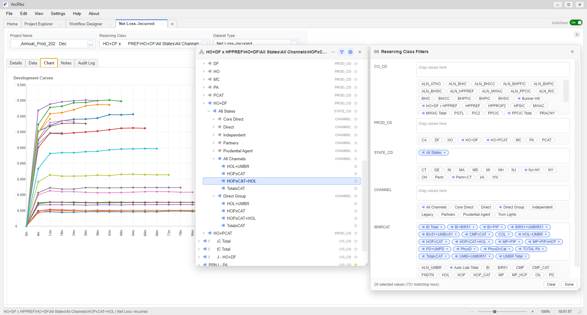
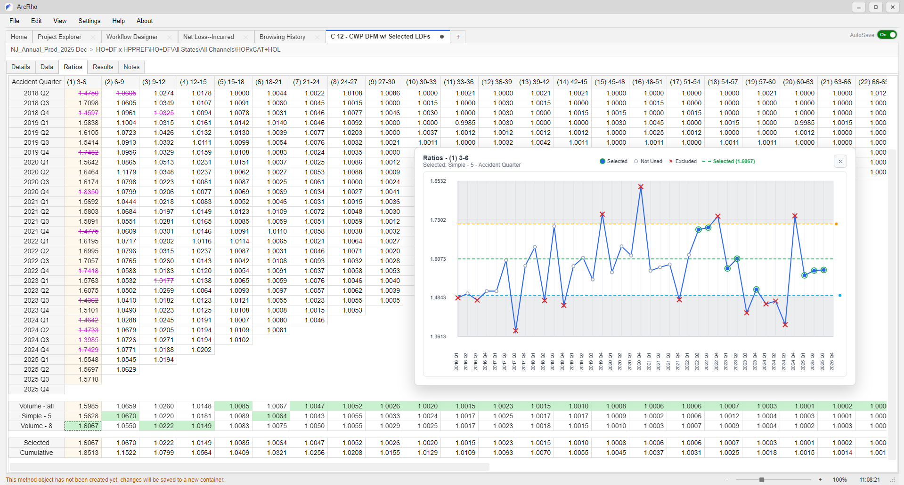
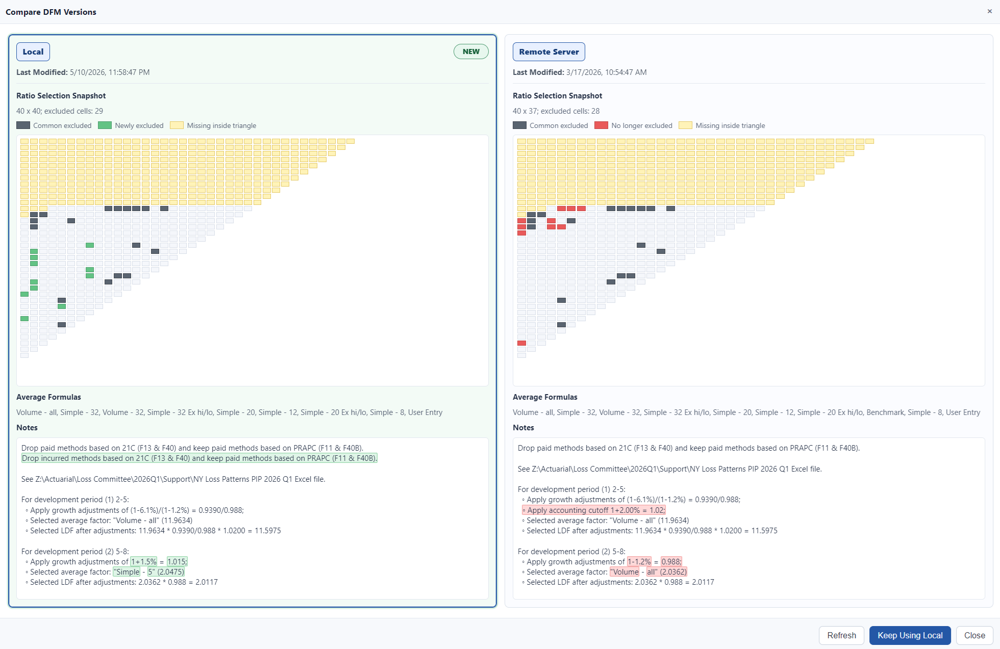
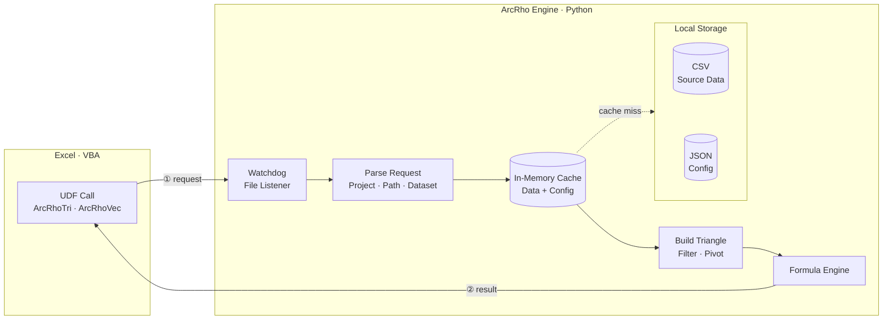

# ArcRho

ArcRho is an actuarial data automation platform focused on loss reserving analytics, with an emphasis on streamlining the end-to-end data preparation pipeline.
It provides a structured framework for transforming raw insurance loss data into reproducible reserving workflows — eliminating manual data handling, accelerating turnaround, and giving actuaries full transparency and control over their assumptions.

## Background & Motivation

Reserving teams face shifting claims patterns, extraordinary loss events, and rapid operational changes, but their tools often lag behind. Workflows still rely on rigid vendor platforms, Excel worksheets, and manual handoffs.

The core problem is structural: traditional project hierarchies require pre-computing datasets, store thousands of rarely used outputs, and need manual updates when coverage or company structures change.

ArcRho replaces that model with on-demand queries against analytics-ready source data, exposed through familiar Excel formulas. It reduces manual transfer, removes vendor dependency, and helps reserving teams respond faster.

## Modernized Web UI for a Seamless User Experience

ArcRho's web UI gives actuaries a flexible workspace for customizing, retrieving, and reviewing triangle datasets without rebuilding a project structure. Users can pull any configured dataset at the level or segment they need, switch assumptions quickly, and use multiple built-in visualization presets to inspect trends, compare patterns, and validate selections before moving deeper into the analysis.

## Discover New Ways to Interact with Reserving Methods

ArcRho keeps familiar actuarial methods at the center, then equips them with modern, user-friendly tools that make method review faster and more transparent. The goal is not only to provide accurate data, but to help actuaries reach more accurate insights through clearer assumptions, easier interaction, and more productive review workflows.

## Compare and Sync Reserving Method Versions

Method Version Compare helps teams review any two historical versions of a chain-ladder method before adopting changes. The comparison view highlights which version is newer, shows side-by-side snapshots of ratio selections, formulas, and notes, and lets users choose which version to keep. This gives actuaries a clear review step before overwriting assumptions, reducing accidental drift while keeping collaboration fast.

---

## Data Processing Engine

ArcRho replaces the traditional vendor-based reserving database with a lightweight, local computation engine that queries flat CSV source tables on demand, builds loss triangles in memory, and returns results directly to Excel — with no pre-computation, no rigid project hierarchy, and no lengthy load times.

### Architecture Overview

### How It Works

**1. Send a request from the frontend**
Users call ArcRho functions directly in Excel or the ArcRho desktop app, such as `=ArcRhoTri(...)`, to get a loss triangle dataset. Each request tells ArcRho which project, reserving class, and dataset to retrieve.

**2. Find the right data**
ArcRho reads the project setup, filters the source data to the requested segment, and uses the configured dataset definitions to determine what should be returned.

**3. Build the result on demand**
Instead of pre-building thousands of triangles, ArcRho constructs only the triangle or vector needed for the current request. Frequently used data stays warm in memory so repeated requests are fast.

---

### Advantages Over Traditional Reserving Databases

| | ArcRho | Traditional Vendor Platform |
|---|---|---|
| **Data structure** | Normalized grain-level fact table | Fixed hierarchical project tree |
| **Project setup** | Edit JSON config files | Rebuild project hierarchy in GUI |
| **Computation model** | On-demand, per request | Pre-compute all datasets before access |
| **Load time** | Near-instant (cached) | Up to half a day for large monthly projects |
| **Storage footprint** | Only source data stored | 10,000+ pre-computed datasets per project |
| **New class / coverage** | Update JSON, request resolves immediately | Manual intervention to fix aggregation dependencies |
| **Custom aggregations** | Define in `reserving_class_types.json` at any time | Requires project rebuild |
| **Formula datasets** | Arithmetic expressions over triangles | Predefined dataset types only |
| **Excel integration** | Drop-in VBA functions matching existing syntax | Vendor-bundled Excel Add-In |
| **Infrastructure** | Runs locally on any machine | Depends on remote server / vendor application |

---

## Excel Add-in

The ArcRho Excel Add-in exposes the data processing engine directly inside Excel through a set of worksheet functions (UDFs) and a custom **ArcRho** ribbon tab. Actuaries work entirely within familiar Excel workflows — no scripting, no vendor GUI — while the Python data engine handles all data retrieval and triangle construction transparently.

### Ribbon

The **ArcRho** ribbon tab provides quick-access shortcuts for the two most common setup actions before calling any formula:

| Button | Purpose |
|---|---|
| **Load Reserving Classes** | Opens a dialog to select and confirm a reserving class path (e.g. `PRNJ-PA\PA\All States\All Channels\PD+UMPD`) |
| **Select Datasets** | Opens a searchable list of all available datasets for the active project |
| **Insert Function** | Inserts a UDF template into the active cell |
| **Clear Formulas** | Removes all ArcRho formulas from the active sheet |
| **Calculate Workbook** | Forces a full recalculation |
| **Refresh Database** | Reloads the source data cache on the data engine |

### Step 1 — Select a Reserving Class Path

Click **Load Reserving Classes** in the ribbon. The dialog presents a cascading set of dropdowns corresponding to the reserving class hierarchy (Company → Product → State → Channel → IBNR Category). Each selection narrows the next level. The resulting path string (shown at the bottom of the dialog) is what you pass as the `Path` argument to any UDF.

### Step 2 — Select a Dataset

Click **Select Datasets** to browse all datasets defined for the active project. Results can be filtered by name, category, or data format. The selected dataset name maps directly to the `TriangleName` / `VectorName` argument in the formulas below.

---

### UDF Reference

All functions use the `ArcRho` prefix.

| Function | Category | Description | Arguments |
|---|---|---|---|
| `ArcRhoTri` | Triangle | Returns a full loss triangle as a spilled array | `Path`, `TriangleName`, `[Cumulative]`, `[Transposed]`, `[Calendar]`, `[ProjectName]`, `[OriginLength]`, `[DevelopmentLength]` |
| `ArcRhoTriDiag` | Triangle | Extracts a single diagonal. `DiagonalIndex = 0` = latest; negative values step back | `Path`, `TriangleName`, `[DiagonalIndex]`, `[Cumulative]`, `[Transposed]`, `[ProjectName]`, `[OriginLength]`, `[DevelopmentLength]` |
| `ArcRhoTriOrigin` | Triangle | Returns one origin-period row across all development ages | `Path`, `TriangleName`, `OriginPeriod`, `[Cumulative]`, `[Transposed]`, `[ProjectName]`, `[OriginLength]`, `[DevelopmentLength]` |
| `ArcRhoTriCell` | Triangle | Returns a single scalar cell at a specified origin and development position | `Path`, `TriangleName`, `OriginPeriod`, `DevelopmentPeriod`, `[Cumulative]`, `[ProjectName]`, `[OriginLength]`, `[DevelopmentLength]` |
| `ArcRhoVec` | Vector | Returns a one-dimensional origin-period vector (e.g. earned exposure, premium) | `Path`, `VectorName`, `[Transposed]`, `[ProjectName]`, `[PeriodLength]` |
| `ArcRhoVecCell` | Vector | Returns a single element from a vector by 1-based index | `Path`, `VectorName`, `Index`, `[ProjectName]`, `[PeriodLength]` |
| `ArcRhoHeaders` | Utility | Returns axis labels for triangle headers. `periodType = 0` = origin labels; `1` = development age labels | `periodType`, `Transposed`, `[PeriodLength]`, `[ProjectName]` |
| `ArcRhoProjectSettings` | Utility | Returns project metadata: name, origin type, start/end dates, development end date, period lengths | `[ProjectName]` |

## License

ArcRho is proprietary software. Copyright (c) 2026 Xiao Wei. All rights reserved.
See [LICENSE](LICENSE) for details.
